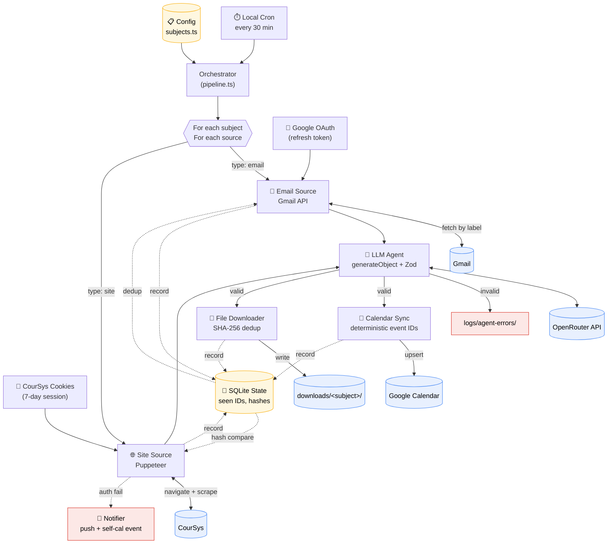

# Auto-Schedule — Architecture

Onboarding reference. Read this first before touching code.

## Pipeline Diagram



## Component Responsibilities

**Orchestrator (`pipeline.ts`)** — Top-level loop. Loads config, iterates subjects and sources, wires fetchers to agent to syncers. Owns no business logic; just composition.

**Sources (`sources/`)** — Strategy pattern on `source.type`. Each fetcher returns normalized content + a list of candidate attachment refs. Sources are responsible for asking the state store whether content is new.

**Auth (`auth/`)** — `google.ts` wraps `googleapis` OAuth refresh. `coursys.ts` loads/saves cookies and validates by hitting an authed URL; on redirect, throws a typed `CourSysAuthError` that the orchestrator catches and routes to the notifier.

**Agent (`agent/`)** — Single `generateObject` call per source-with-new-content. Vercel AI SDK with the OpenAI provider pointed at OpenRouter's base URL. Zod schema is the source of truth: the SDK serializes it to JSON Schema for the model and validates the response back to a typed object. Stateless. Invalid output is logged but never written to Calendar.

**Sync (`sync/`)** — `calendar.ts` upserts via deterministic IDs (`subject.id`-`itemId`, sanitized). `files.ts` downloads with appropriate auth (Gmail attachment API for email sources, Puppeteer-derived cookies for site sources), hashes, and writes.

**State (`state/`)** — SQLite, four tables: `seen_emails`, `site_hashes`, `downloaded_files`, `synced_events`. Single source of truth for "have I done this before."

**Notifier (`notify/`)** — Push notification (ntfy or Pushover) plus a self-scheduled calendar event reminding the human to re-auth.

## Data Flow Contracts

```
Source → Orchestrator:    { content: string, attachments: AttachmentRef[], sourceMeta }
Orchestrator → Agent:     { subject: Subject, source: Source, content: string }
Agent → Orchestrator:     CalendarEventList   (Zod-validated)
Orchestrator → Calendar:  upsert(eventId = sanitize(`${subject.id}-${item.itemId}`), event)
Orchestrator → Files:     download(url, destFolder, expectedFilename)
```

## Idempotency at a Glance

- **Re-running the cron job mid-day is safe.** Nothing duplicates.
- **Calendar:** event IDs are deterministic functions of `(subject.id, item.itemId)`. Update == upsert.
- **Emails:** Gmail message ID stored in `seen_emails` after successful processing.
- **Site pages:** SHA-256 of normalized text in `site_hashes`. Unchanged page = skip agent call entirely (saves OpenRouter credits).
- **Files:** SHA-256 of bytes in `downloaded_files`. Same bytes never written twice.

## Failure Modes

| Failure | Detection | Response |
|---|---|---|
| CourSys session expired | Redirect to CAS login | Push notification + self-cal event; exit 2 |
| Google token revoked | API 401 | Same as above (separate notification) |
| Agent returns invalid JSON | `generateObject` throws | Log raw output to `logs/agent-errors/`; skip event, continue |
| OpenRouter rate/credit error | API 429 / 402 | Backoff and retry once; preserve state for next run |
| Network flake on attachment | Fetch throws | Retry once with backoff; log and continue if still failing |
| Calendar API rate limit | API 429 | Exponential backoff; state preserved so next run picks up |

## Setup Commands

```bash
npm install
npm run setup:google      # one-time browser OAuth
npm run setup:coursys     # one-time headful login
npm run build
npm run run               # manual test
# then add the cron line from PLAN.md
```

## Adding a New Subject

1. Edit `src/config/subjects.ts`, add a `Subject` entry.
2. If using an email source, set up a Gmail label and a forwarding/filter rule.
3. `mkdir -p downloads/<subject-id>`.
4. Run once manually to seed state and verify.

No code changes required — the orchestrator is data-driven.

## Swapping the Agent Model

Edit `src/agent/extractor.ts`, change the model string in `openrouter('<provider>/<model>')`. OpenRouter routes by that string. Re-run a manual `npm run run` and check `logs/agent-errors/` is empty before re-enabling cron.
