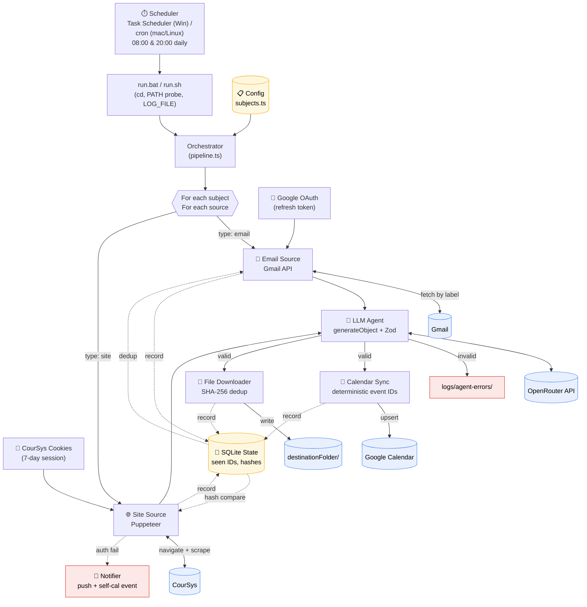

# Auto-Schedule — Architecture

Onboarding reference. Read this first before touching code. For setup + day-to-day
usage, see the top-level `README.md`.

## Pipeline Diagram



## Component Responsibilities

**Orchestrator (`pipeline.ts`)** — Top-level loop. Iterates subjects and sources, wires fetchers to the agent to the syncers, downloads attachments, and emits step-by-step breadcrumb logs (`→ subject`, `↳ source`, `→ asking agent`, etc.). Owns no business logic; just composition. A `CourSysAuthError` propagates out and aborts the whole run.

**Sources (`sources/`)** — Strategy pattern on `source.type`, dispatched by `FetcherRegistry`. Each fetcher returns normalized content + a list of candidate attachment refs. Sources ask the state store whether content is new before doing any work. The site fetcher reuses one headless Chromium across all subjects in a run; the registry closes it in the pipeline's `finally`.

**Auth (`auth/`)** — `google.ts` wraps `googleapis` OAuth: an installed-app loopback flow on `http://127.0.0.1:53682/oauth2callback` writes the refresh token to `data/auth/google.json` (chmod 600 where supported); `googleapis` refreshes access tokens automatically thereafter. `coursys.ts` loads/saves cookies and validates by hitting an authed URL; on a redirect to `cas.sfu.ca` / `sso.sfu.ca` it throws a typed `CourSysAuthError` that the orchestrator catches and routes to the notifier.

**Agent (`agent/`)** — Single `generateObject` call per source-with-new-content. Vercel AI SDK with the OpenAI provider pointed at OpenRouter's base URL. The Zod schema is the source of truth: the SDK serializes it to JSON Schema for the model and validates the response back to a typed object. Stateless. `attachments` is required (always `[]` when absent) so OpenAI strict structured outputs accept the schema. Invalid output is captured to `logs/agent-errors/<timestamp>__<subject>__<slug>.json` (with `responseBody`, `statusCode`, and `rawModelOutput`) but never written to Calendar. The model is `process.env.AGENT_MODEL` (default `openai/gpt-4o-mini`), `maxTokens` is 2000.

**Sync (`sync/`)** — `calendar.ts` upserts via deterministic IDs: `sanitizeEventId(subject.id, item.itemId)` produces a lowercase base32hex string that Google Calendar accepts as `events.update` or, on 404, `events.insert`. `files.ts` dispatches on URL scheme: `gmail://` refs are fetched via the Gmail attachment API with the live OAuth client; `http(s)://` URLs go through `fetch`, layering CourSys session cookies when the hostname matches. SHA-256 of bytes is checked against `downloaded_files` before writing, so re-downloads are free.

**State (`state/`)** — SQLite (WAL mode), four tables: `seen_emails`, `site_hashes`, `downloaded_files`, `synced_events`. Single source of truth for "have I done this before." Schema migrates on every boot via `CREATE TABLE IF NOT EXISTS`.

**Notifier (`notify/`)** — Push via ntfy (`NTFY_TOPIC`) or Pushover (`PUSHOVER_TOKEN` + `PUSHOVER_USER`); warns if neither is set. On `CourSysAuthError` it also upserts a "re-auth coursys" calendar event in the next 30-min slot (rounded up to the next 15-min boundary; pushed to tomorrow 09:00 if today is full) using a deterministic ID so retries don't spam the calendar.

**Logger (`logger.ts`)** — pino with a multi-target transport: stdout (pretty, colorized in a TTY) plus a file (pretty, never colorized) when `LOG_FILE` is set. `LOG_JSON=1` flips both streams to raw JSON for a log aggregator. `LOG_LEVEL=debug` increases verbosity.

## Data Flow Contracts

```
Scheduler → run.bat/run.sh:    sets LOG_FILE, ensures node on PATH, exec node dist/index.js run
Source → Orchestrator:         SourceItem { sourceItemId, content, attachments[], meta? }
Orchestrator → Agent:          (subject, source, content) → CalendarEventList | null
Agent → Orchestrator:          CalendarEventList   (Zod-validated)
Orchestrator → Calendar:       upsertEvent(auth, subject.id, event, store)
                                 → eventId = sanitizeEventId(subject.id, event.itemId)
Orchestrator → Files:          downloadAttachment(attachment, destFolder, { googleAuth, store })
```

## Idempotency at a Glance

- **Re-running the cron job mid-day is safe.** Nothing duplicates.
- **Calendar:** event IDs are deterministic functions of `(subject.id, item.itemId)`. `events.update` == upsert; falls back to `events.insert` on 404.
- **Emails:** Gmail message ID stored in `seen_emails` after successful processing. Marked AFTER calendar upserts so a mid-item failure re-runs cleanly.
- **Site pages:** SHA-256 of normalized text in `site_hashes`. Unchanged page = skip the agent entirely (saves OpenRouter credits). Hash written AFTER successful upserts for the same reason.
- **Files:** SHA-256 of bytes in `downloaded_files`. Same bytes never written twice, even across subjects.

## Failure Modes

| Failure | Detection | Response |
|---|---|---|
| CourSys session expired | Redirect to `cas.sfu.ca` / `sso.sfu.ca` | Push notification + self-cal event; exit 2 |
| Google token revoked | API 401 | Surfaces as fatal; user must re-run `setup:google` |
| Agent returns invalid JSON | `NoObjectGeneratedError` / Zod throw | Log `responseBody` + `rawModelOutput` to `logs/agent-errors/`; skip item, continue |
| OpenRouter 4xx (bad schema / out of credits) | `APICallError` with status code | Full error body logged; skip item, continue |
| Network flake on attachment | `fetch` throws | Log and continue (the agent is the load-bearing step, not the file) |
| Calendar API rate limit | API 429 | Currently propagates as a source-level failure; state is preserved for next run |

## Setup Commands

```bash
npm install
npm run setup:google      # one-time browser OAuth (loopback at :53682)
npm run setup:coursys     # one-time headful CourSys login
npm run build
npm run run               # manual test
```

Schedule via Windows Task Scheduler (`run.bat`) or cron (`run.sh`) — see the README.

## Adding a New Subject

1. Edit `src/config/subjects.ts`, add a `Subject` entry.
2. If using an email source, set up a Gmail label and a filter/forwarding rule that applies it.
3. `destinationFolder` may be relative (resolved from the repo root) or absolute (`D:/Studies/cmpt307`). The path will be created on first download.
4. Run `npm run build && npm run run` once manually to seed state and verify.

No code changes required — the orchestrator is data-driven.

## Swapping the Agent Model

Set `AGENT_MODEL` in `.env` to any OpenRouter model string:

```
AGENT_MODEL=anthropic/claude-haiku-4-5
```

Re-run `npm run run` and check `logs/agent-errors/` is empty before re-enabling cron. The Zod schema is strict-structured-outputs friendly, so any provider that supports JSON Schema response_format will work.

## Logging Knobs

| Env | Effect |
|---|---|
| `LOG_FILE=path/to/file.log` | Mirror all output to this file (set automatically by `run.bat` / `run.sh`) |
| `LOG_JSON=1` | Raw JSON on stdout and the file (for log aggregators) |
| `LOG_LEVEL=debug` | More verbose breadcrumbs |
| `AUTO_SCHEDULE_NO_JITTER=1` | Skip the 0–60 s startup jitter (the jitter is only useful for sub-hour schedules) |
